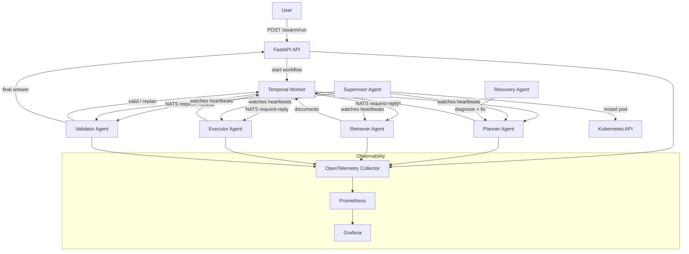

# Artifex – Production Agent Swarm

> **LangGraph + NATS + Temporal** – a stateful, fault-tolerant multi-agent system.

---

## Architecture



### Agent Roles

| Agent | Subject(s) | Responsibility |
|-------|-----------|----------------|
| **Planner** | `agent.planner.request`, `agent.planner.replan` | Decomposes goals into task lists using GPT-4o |
| **Retriever** | `agent.retriever.inbox` | Embeds queries and searches Qdrant |
| **Executor** | `agent.executor.inbox` | Runs HTTP, shell, or file tools |
| **Validator** | `agent.validator.inbox` | LLM critic – approves or triggers replan |
| **Supervisor** | `agent.*.heartbeat` | Detects dead agents, restarts K8s pods |
| **Recovery** | `validator.failed` | Diagnoses failures, suggests corrected tasks |

---

## Quick Start (Local)

### Prerequisites
- Docker + Docker Compose
- Python 3.11+
- An OpenAI API key

### 1. Clone and configure

```bash
git clone <repo>
cd Artifex-final
cp .env.example .env
# Edit .env – set OPENAI_API_KEY
```

### 2. Run locally

```bash
make dev
# or
bash scripts/run_local.sh
```

### 3. Submit a goal

```bash
curl -X POST http://localhost:8000/swarm/run \
  -H "Content-Type: application/json" \
  -d '{"goal": "What is the capital of France?"}'
```

Response:
```json
{
  "workflow_id": "artifex-a1b2c3d4e5f6",
  "trace_id": "9f8e7d6c5b4a3210",
  "status": "started",
  "message": "Workflow submitted successfully"
}
```

### 4. Check status

```bash
curl http://localhost:8000/swarm/status/artifex-a1b2c3d4e5f6
```

---

## Deploy to Kubernetes

### Prerequisites
- `kubectl` configured for your cluster
- Images pushed to a registry (update `image:` in `k8s/deployments/`)

```bash
# Set your OpenAI key in k8s/secrets.yaml first
make deploy
```

### Monitor

```bash
make observe          # port-forward Grafana → http://localhost:3000
make observe-prometheus
```

Default Grafana credentials: `admin / artifex`

---

## Development

```bash
make install          # install Python deps
make test             # run pytest with coverage
make lint             # ruff + mypy
make fmt              # auto-format with ruff
```

---

## Configuration

All configuration is via environment variables (see `.env.example`):

| Variable | Default | Description |
|----------|---------|-------------|
| `GROQ_API_KEY` | – | Required – Groq API key |
| `NATS_URL` | `nats://localhost:4222` | NATS broker URL |
| `TEMPORAL_HOST` | `localhost:7233` | Temporal frontend address |
| `QDRANT_URL` | `http://localhost:6333` | Qdrant vector DB |
| `REDIS_URL` | `redis://localhost:6379` | Redis (idempotency) |
| `OTEL_EXPORTER_OTLP_ENDPOINT` | `http://localhost:4317` | OTel collector |

---

## Project Structure

```
Artifex-final/
├── agents/          # Individual agent implementations
├── workflows/       # LangGraph graph + Temporal worker
├── api/             # FastAPI REST API
├── nats_client/     # NATS connection manager + subjects
├── tools/           # HTTP, shell, file, vector tools
├── docker/          # Per-agent Dockerfiles
├── k8s/             # Kubernetes manifests
├── observability/   # Prometheus, Grafana, OTel configs
├── tests/           # pytest test suite
└── scripts/         # Local run + K8s deploy scripts
```

---

## License

MIT
